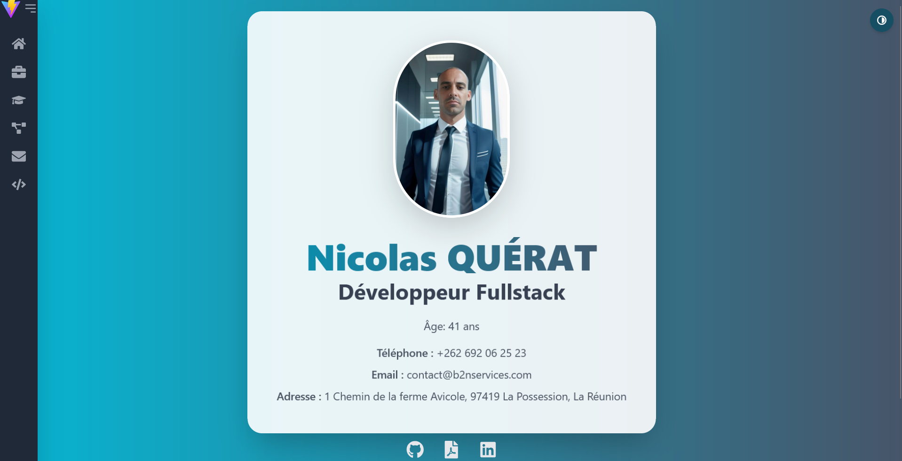

# Nicolas QUÉRAT
**Développeur Fullstack**

Passionné de développement, j'aime travailler sur des projets qui me tiennent à cœur.

<p align="left">
    <a href="https://github.com/Nickosss97435">
        
    </a>
    <a href="https://b2nservices.com">
        
    </a>
    <a href="https://cv-nickosss35974.vercel.app/">
        
    </a>
    <a href="https://www.youtube.com">
        <i class="fab fa-youtube" style="font-size: 64px; color: red;"></i>
    </a>
</p>

---

### 🧰 Langages, Frameworks et Outils

<p align="left">
    
    
    
    
    
    
    
    
</p>

---

### 📊 Stats


---

### 📁 Structure du projet cv-react

```plaintext
cv-react/
├── public/
│   └── cv.pdf
├── src/
│   ├── assets/
│   │   └── profile.jpeg
│   ├── components/
│   │   ├── Header.jsx
│   │   ├── Sidebar.jsx
│   │   ├── AnimatedSection.jsx
│   │   ├── Timeline.jsx
│   │   └── ProjectCard.jsx
│   ├── data/
│   │   ├── about.json
│   │   ├── experience.json
│   │   ├── education.json
│   │   └── projects.json
│   ├── pages/
│   │   ├── Home.jsx
│   │   ├── Experience.jsx
│   │   ├── Education.jsx
│   │   ├── Projects.jsx
│   │   └── Contact.jsx
│   ├── App.jsx
│   ├── main.jsx
│   └── theme.js
├── tailwind.config.js
├── vite.config.js
└── package.json